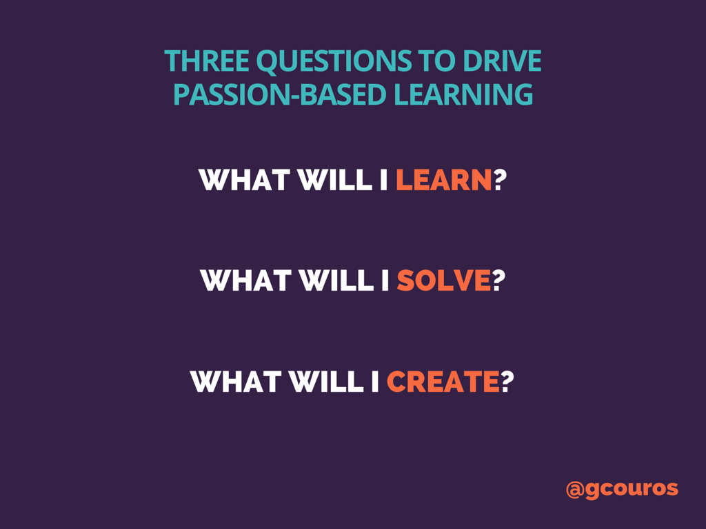
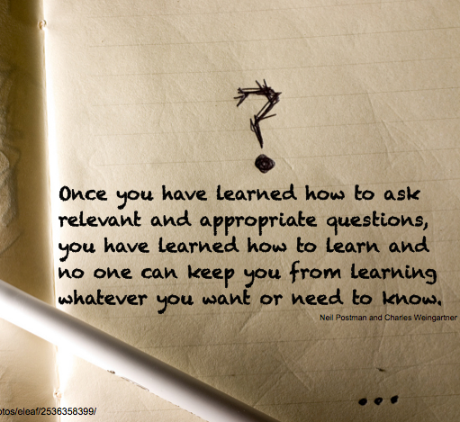

## The Key to Sounding Smart

Let’s establish a fact: everyone wants to be smart. Although many probably think they aren’t 
smart, they can definitely *sound* smart and play the part to boot. Not only does sounding 
smart make people look good (superficially), but it also helps others think and have challenging 
conversations. This is why it’s crucial to ask questions, especially the right questions. 
Some may find it difficult to frame questions in an intelligent manner; yet as most know, 
it’s easy to ask questions without thinking about it first. Of course, many would opt to ask 
the easy questions since it’s a fast way to “ask” for help from experienced users. After all, 
simply asking a one-lined question followed by a “Please help me” plea on a forum board, such as 
StackOverflow, is easy; however, it does not guarantee help from other forum users nor does it
help anyone, including the asker, in any way. For this reason, it is important to ask as, 
Eric Raymond suggests, the “smart” questions.  

In his article “[How To Ask Questions the Smart Way](http://www.catb.org/esr/faqs/smart-questions.html),” 
Raymond illuminates readers on the proper etiquette to asking questions the right way. 
In the article, he lists and explains the criteria of a “smart” question and its opposite.
Essentially, to form smart questions, one needs to: 
* Research a solution or acquire more information about their problem before asking their question
* Create a title that adds more specifications to their problem, such as the operating system they are running their program on
* Provide enough details to explain their problem (and possibly replicate it)
* Be courteous and show gratitude to future repliers
* Lastly, check their grammar before sending in their question

These guidelines help users contribute invigorating and innovative questions that stimulate 
thought within the community and allow users to have thought-provoking conversations with other 
hackers, otherwise known as the members of the computer science community. At the same time, by asking questions 
users can maintain the atmosphere of the forum. 

  

## Learning Makes You Smarter

Admittingly, encapsulating a problem in an intriguing manner to receive a solution is difficult. 
A question should have just enough detail, not too little and not too much, to describe the 
problem. Otherwise, the aftermath could be very problematic. As such, an example of demonstrating
the right way to ask a “smart” question comes from a [post](https://stackoverflow.com/questions/45936800/emscripten-canvas-jquery-toggle-focus) 
made by a StackOverflow user. The gist of the problem was to keep a canvas on a chat box in a HTML 
web page using a combination of HTML, Javascript, and jQuery. Of course, the details of the problem 
were very specific and aimed toward an audience familiar with these programming languages. However, 
someone, such as myself, who is unfamiliar with the vernacular used within this question, understands 
that this user attempted to find a solution to their problem before making their post on 
StackOverflow. He/she was very thorough with the details of their problem and also updated their
question after receiving responses from other users. Although there was maybe one grammatical 
error in this post and not as much communication between users, it is clear that the user gave 
enough details for other hackers to consider and come up with a working solution. This learning 
experience alone allowed the user to gain more knowledge while giving hackers the opportunity to 
challenge their expertise, which is always a plus.  

## Onto the Other End of the Spectrum

Now it’s time to talk about the “bad” questions, as Raymond puts it, which are the complete 
opposite of smart questions. These questions are commonly ignored by other users in the community.
In the worst case, hackers could criticize the user for asking such a ridiculous question and 
publicly humiliate them. As one can see, those who ask bad questions are mainly looking for 
quick solutions and have no intention of learning or communicating with the community. 
An [example](https://stackoverflow.com/questions/46048395/how-we-can-create-the-folder-in-google-drive-by-using-java) 
of this comes from another user of StackOverflow who asked the community to help them use Java, 
a common computer language, to create folders in Google Drive. Initially, this question 
provided no code, had no further context or details to the problem, and had a simple title. 
It demonstrated the user’s need to look for a simple fix to their problem and that they did 
not research before asking. Presently, the user fixed their question to have a snippet of
their program and potential output after being verbally wrecked by other forum users. Based on 
this small example, the importance of framing a question in an intelligent way is obvious, 
especially since no one wants to be in a hacker war zone. Trust me, it is not a pretty scene 
(no matter how ridiculous the user’s question is).  

## So What Have We Learned?

Although it may not seem like much, smart questions can inspire others to learn in a stimulating 
environment. The conversations generated from smart questions and solutions build history for 
future and present hackers to learn and solve together. As I would like to believe, humans strive
to learn in order to become their best selves for their own sake and for society. All of us 
learn something new everyday, contributing to this goal. What better way to start learning 
than to ask questions the smart way? After all, questions gets people places and solutions bring 
people together. 

