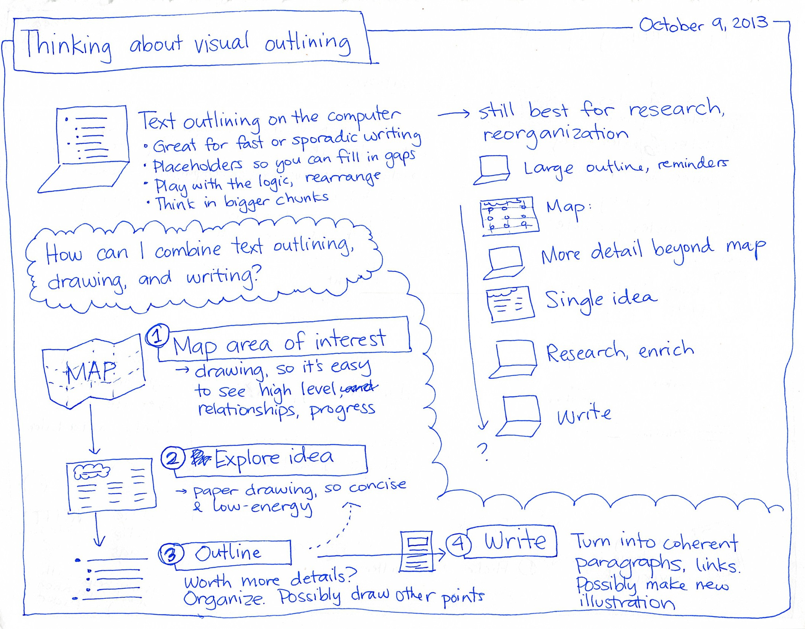
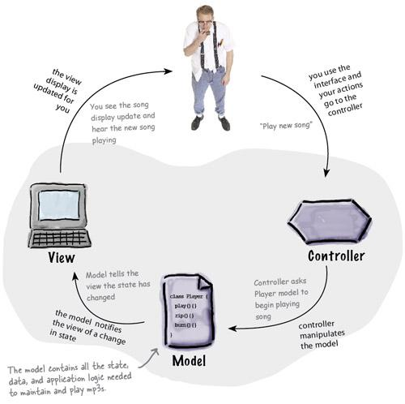

## Design Patterns or Outlines?

Outlines are much like Design Patterns. But what on earth is a design pattern? To explain it simply, a design pattern is a template that can be reused to structure the layout of their source code depending on the specific type of project, such as a user interface or database. Doesn’t this resemble something we all use, perhaps in writing? Of course! It’s like an outline! Usually, an outline would be used if one wanted to follow a structure of what they want to write about in their paper. 

An outline is often used to help one write out their ideas and thoughts in order to generate substantial material for their essay. Whether it’s figuring out what the bulk of the paper should say or how to introduce the topic(s), *every component* in the writing process is important! So much so that it is necessary to *_frame_* it in a simple and comprehensive way, to an extent. After all, going in blind in terms of writing, either source code or an essay, is usually not the best approach for one to take.

Similar to outlining though, design patterns often help an innovator form the architecture of their source code in a digital format. This allows them to lay out their thought process into code and provide more models to use in the future. Of course, there are many design patterns out there in the world, making it slightly easier for designers and engineers to figure out how to frame their source code in order to fulfill a client’s request and their personal goals. 

## So what’s the point of Design Patterns and Outlines?

### Looking at it from a writing perspective 

Although not as obvious, both design patterns and outlines allow one to decide which style best suites their product, whether it be an application or a paper. What do I mean by this? Take for instance needing to write a research paper for a science course (or for any course for that matter). Of course extensive research is necessary to write a research paper, yet, the style of a research paper differs greatly from other types of papers, like this piece I am currently writing. In a research paper, one needs to state facts and provide evidence while thoroughly explaining them in order to build their argument. In other words, writing research requires one to be objective and be able to support their points with valid evidence. There’s technically no room for jokes or sarcasm. As such, the outline should be straightforward with evidence that support important points. 

On the other hand, reflection papers and newspaper articles  allow the writer to have a bit more wiggle room. They’re free to joke around so long as the jokes aren’t overbearing and relate to the topic at hand. In the case of reflections, much of the information would be subjective as the writer is addressing their perceptions and experiences about the specified topic. The outline in this case may still provide conclusive evidence, but is more focused on answering questions in a lighthearted manner. As one can see, it’s blatantly obvious that the style of writing calls for different types of outlines.     

### What does it look like on the software side of things?

If you think design patterns don’t fit at all, then you may be mistaken about how to use design patterns. As stated before, there are plenty of design patterns exist in the world; you can even create your own design pattern if you choose to! However, the issue would be deciding which pattern would be better. For instance, one wouldn’t want to use only a Prototype design pattern, which is a way to use copies of data instances, when a user interface is created. Copying data instances will only do so much to the behavior of an application, not very fit for visual design. Rather a Model-View-Controller (MVC) design that joins the visual aspects the user will see with the background behaviors and states of the application in combination with other design patterns (possibly with the Prototype pattern) should be used. More information on these patterns and many more can be found at this [site](https://sourcemaking.com/design_patterns) and in this [video](https://www.youtube.com/watch?time_continue=982&v=Z2yjimK_MJU) both of which introduce a existing design patterns. It’s easy to see that different patterns are necessary for different situations, similar to the need to use different outline styles for different types of writing.  

These design patterns are especially relevant in today’s age, given how frequently they’re used among coders. Young coders are taught design patterns without knowing what they actually are. I’ve come to learn that I have had experience with utilizing design patterns without realizing it. For instance, I am rather accustomed to using the Prototype pattern, Private Class Data pattern, which limits the access of data to private variables, and Proxy pattern that utilizes a sources object of a class to create other objects with similar features to that object. My association and comfortability with these patterns most likely stem from my experience with Object Oriented Programming from C, C++ and Java. 

## The effect of design patterns 

Recently, I’ve learned to implement a MVC approach/pattern in designing a web application. I have become a little comfortable with designing with the structure of this approach. Being able to combine the visual aspects of a user interface application with what is happening in the background is an interesting process that I was initially not used to. Through this approach, I have become familiar with the process of web application development  and have come to realize that it takes *_a lot_* of effort to put together a fully working, visually pleasing application. This makes me greatly appreciate that the MVC pattern was invented.       

