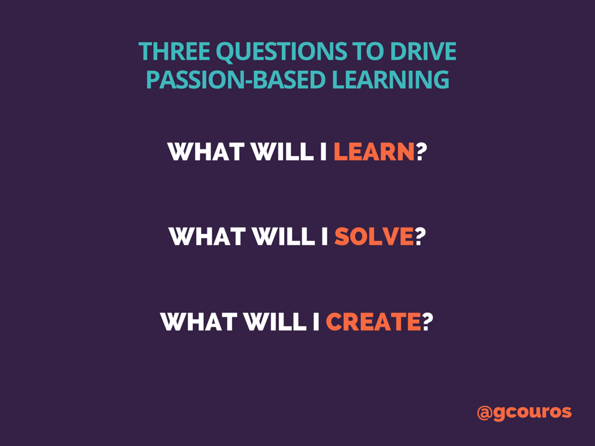
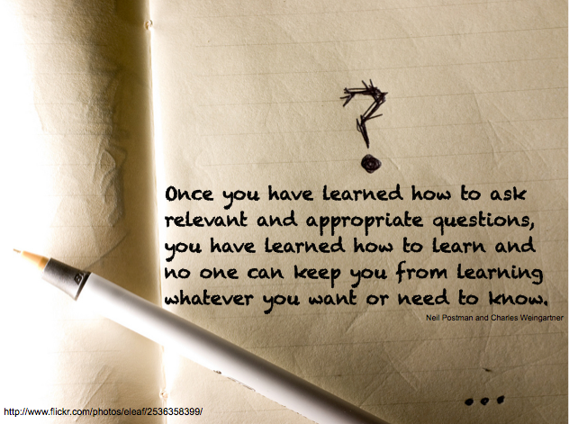

## Starting with the Basics

Almost every programmer should know (implicitly) this answer to this heading. If you’re a 
beginner in programming, you will learn what this is soon enough. Simply put, coding standards 
are guidelines to how a programmer should construct their source code. *Summed perfectly by 
David Mytton who wrote “[Why You Need Coding Standards](https://www.google.com/url?q=https://www.sitepoint.com/coding-standards/&sa=D&ust=1505977164874000&usg=AFQjCNGxpM_-kka-QARu434KQw1tE4R5Kw),” 
coding standards “tells developers how they must write their code.* In his article, 
Mytton further suggests questions to how one should develop or declare their coding standards 
and provides examples to various coding standards seen in computer languages, such as Javascript. 
For instance, the coding standard implemented in my Information & Computer Science 314 course is 
[ESLint](https://eslint.org/docs/about/). It finds various errors, such as syntax, compilation, or 
runtime errors, in real-time while the programmer is writing their source code. To signify the 
correctness of the code, a green checkmark will appear, possibly in the right corner, of their IDE. 
This green checkmark is what every programmer should aim for in order to prevent any errors that 
could hinder their code from functioning.  

  

## IntelliJent Enough for the Green Check?

Aside from using ESLint, we also use IntelliJ, which is an Integrated Development Environment (IDE) 
that allows programmers to write various languages of code, including Javascript, HTML, and many more. 
With ESLint enabled in IntelliJ (and other procedures done), one will know if their source code will
function correctly by seeing the green checkmark in the corner of their editing window, as mentioned before. 

Let’s be real here, getting the green checkmark to appear is both a blessing and a curse. Seeing 
nothing but red and yellow squares, which implies there are errors in the code, can be agonizing. 
It’s always difficult to debug, or search and fix errors, in one’s code whether it’s a syntax 
error or some other type of error and could take hours trying to figure out what was wrong with 
the code. It could even take days to finally understand why there is an error up to the point of 
staring at your code and hoping for it to tell you what was wrong with it (I speak from experience, 
it’s a rough 48 hours). Yet, when all the errors are finally fixed, extreme relief and gratitude 
for the code working rushes through. 

Even though this coding standard allows one to see errors in real-time, it denies programmers the 
chance to learn various skills important, especially for the future. One of these essential tools is tracing. 
Past experience has taught me that tracing is one of **_the most important_** skills one could ever 
learn in their programming career. Having used both C/C++ on a Unix machine and Java on an 
[Eclipse](https://www.google.com/url?q=https://eclipse.org/ide/&sa=D&ust=1505975379795000&usg=AFQjCNHI1V59mkTEJcRExsaO5dYnd8Z_Pw) 
IDE allowed me to see that real-time error checking does not allow for much learning. Yes programmers 
can fix their source code quickly and easily, there is a risk that they won’t understand _why_ their 
code is wrong. Understanding how your program functions allows people to become better programmers 
in the long run. The problem I see with real-time error checking is not being able to trace through 
code effectively by problem solving to see where the problem lies in their code. For instance, 
using a compiler and linker separately (whether one is given a choice or not) forces programmers to
thoroughly understand their code because multiple errors could stem from one misspelled word 
(otherwise known as a syntax error).  

## Coding Standards are the New Style

With this discussion about coding standards in mind, I ultimately believe having coding standards 
in place are important in terms of **style**. For one, coding standards make source code look cleaner 
and more user-friendly for others to view and edit that piece of code (if it is a part of a 
collaboration project). I’m sure most people have encountered source code that is difficult to read 
and hurts the eyes (maybe even blinding people) because of how messy it is. A potential reason for messy 
and unreadable code could come from not implementing or adhering to a specific coding standard. And as 
we all know, unreadable code means difficulty in understanding what the code actually does. In short, 
without coding standards, stuff can get really messy and complicated fast!

Although I feel some coding standards make source code look better and cleaner than others, it is 
entirely up to one’s perception on coding standards and the coding world. Perhaps varying coding 
standards between languages *does* improve the quality, readability, and appearance of code. Or perhaps 
using a preferred way to, in essence, style one’s code to fit their standards after experiencing other 
coding standards is the best way to go. Ultimately, it is good to enforce coding standards for beginners 
so that they become accustomed to how code should be styled in a particular language. However, everyone 
eventually develops their own standard for coding in whichever way they are comfortable with in order 
to make their code readable to others. 
