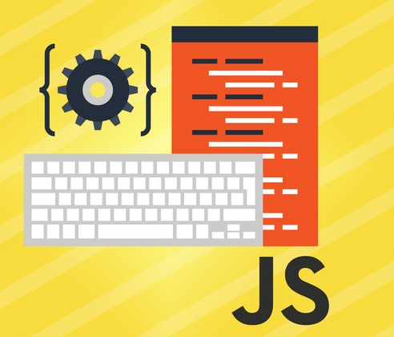

## The Power of Javascript

Initially, Javascript seemed intimidating and difficult to learn. However, I was wrong. 
Clearly, there are differences between Javascript and other programming languages, such 
as Java and C; yet, similarities also exist. For instance, Javascript utilizes the strict
equality operator symbol (===) and its property, which is comparing two data types 
together, while Java and C do not. At first, I was cautious in using this symbol because 
it was foreign to me. Now, I’m aware of how powerful and unique this tool is, making this
language even more intriguing. 

That being said, Javascript appears to be a decent language for beginner software engineers.
It seems to be a simpler version of Java with a mixture of C++ since it shares many 
commonalities between the two languages. Along these lines, a benefit Javascript offers 
is the ability to use classes and Object Oriented Programming. OOP is a powerful tool 
for developers and I believe having it in Javascript would make it easier for people to 
create software.  

## A Perspective on Athletic Software Engineering 

Aside from learning Javascript, athletic software engineering was also a novel and unique 
experience for me. The practice Work Out of the Day used to prepare students for athletic 
software engineering were very beneficial. By practicing these problems, I was able to 
build an idea of what future WODs would be like. It also helped me gain more practice 
coding in a language I wasn’t used. There is a downside, however, which is the high stress 
level associated with this style of learning. Nevertheless, I believe it is to our 
advantageous. If taken seriously, practicing WODs will condition students to function 
in a fast-paced environment and to think on their feet. In theory, it’s a convenient 
way to help people adapt to the type of environment software engineers are used to.  

Although the idea behind the practice WODs is interesting, I would not say they are 
particularly enjoyable. Despite liking the concept of it, I am still not confident 
in my skills and ability to perform well in the WODs. It’s good for providing some 
sort of mental preparation before programming within a limited amount of time; 
however, I don’t believe this style of learning is something I would come to enjoy. 
Therefore, I cannot say at this time if this particular style of learning will benefit
me. Despite saying this, I hope to learn valuable skills from this experience because 
in theory, practice is how humans learn effectively. The only way to get better at 
something is to practice day after day. This is a lesson I was taught time and 
time again and I will always put it to good use.    

