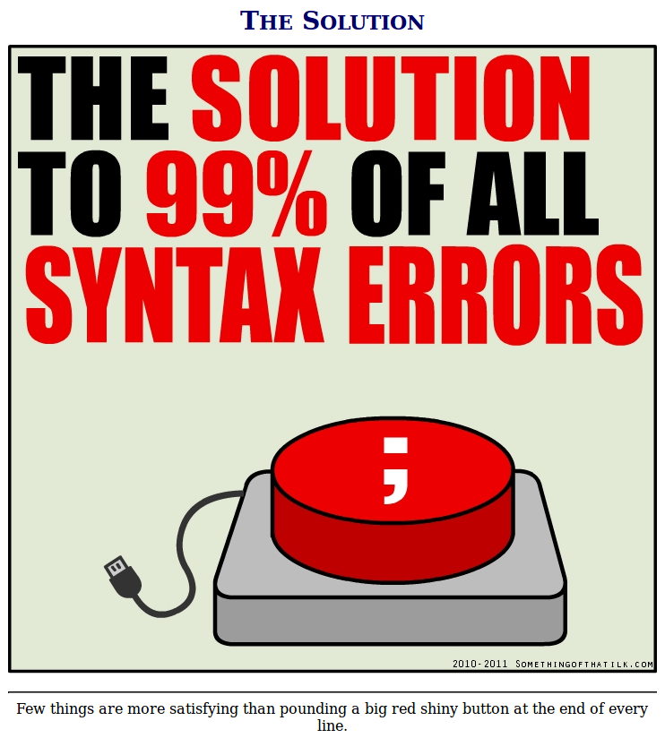
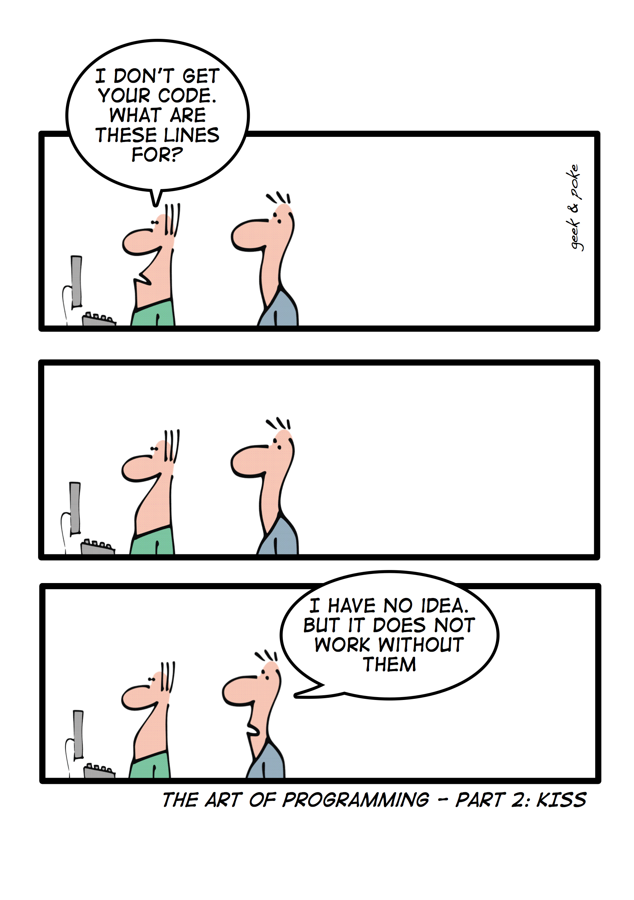

## Which Error is Your Kryptonite?

Syntax errors are your worst enemy. It is most definitely any coder's kryptonite. Indeed, a tiny spelling error can cause absolute mayhem in any coder's life. Now, you may be thinking "what's a syntax error and why is it so bad?" To put it simply, it's an error the compiler deems grammatically incorrect in the specific language one is coding in. And yes, misspelled words count as a grammatical error, a very big one at that. It may not seem that bad at first, what can a small misspelled word do to my program? Oh everything, it can do everything. One syntax error can initiate a snowball effect of errors that may or may not have anything to do with the actual problem. And that is where debugging be messy and time consuming. 
 
 

   
 

 
 For instance, a simple grammatical error could mask the bigger problem of a runtime error, which are the trickiest to catch (among other errors). These often go unnoticed to programmers and could potentially cause chaos to a coder's life. Avoiding these types of errors is possible if one understands the importance of **coding standards**, an essential part of any programmer's first years in coding. 

## So, What On Earth Are Coding Standards?

Simply put, coding standards are guidelines to how a programmer should construct their source
code. *Summed perfectly by David Mytton who wrote the article
“[Why You Need Coding Standards](https://www.sitepoint.com/coding-standards/),” he explains how a 
 coding standard “tells developers how they must write their code.”* Mytton further suggests how one should develop or declare their coding standards and provides examples to various coding standards seen in different computer languages, such as C. For instance, the coding standard implemented in my Information & Computer Science 314 course, Software Engineering, is [ESLint](https://eslint.org/docs/about/). The job of ESLint is simple: it finds errors, like good ol' syntax errors, in real-time while the programmer is writing their source code in, possibly, an Integrated Development Environment, or IDE. To note, the IDE used in my class is IntelliJ. This particular IDE is very powerful and versatile as programmers can write in various languages within it, inccluding Javascript, HTML, and many more. A very useful tool for writing the source code of a web application for example. 

### IntelliJent Enough to Earn the Green Check?

In IntelliJ, a green check mark may appear in the right hand corner to signify the correctness of your source code. That is, no syntax errors, or any other errors, exist to hinder your progress. The real errors on the other hand will definitely pop up if a red or yellow box appears in the corner of the editor. These are bad colors, ones you never want to see when coding. If something red or yellow (mainly red) appears on your code, then you may be doing something *very* wrong. These colors mean that your source code either does not follow the set coding standard, the language, or a spelling error could exist (e.g. “wrod” instead of “word”). With that said, the green check mark is a goal **_every_** programmer should aim for so that one's code will function.    

But let’s get real here, that green check mark is both a blessing and a **curse**. It's *agonizing* to see nothing but red and yellow all over your source code. After all, it makes debugging, which is searching and fixing errors, difficult since the error, which could be a syntax error or some other type, could take hours of figuring out exactly what went wrong with your code. Of course, it is **_incredibly_** frustrating to discover that the whole reason your code isn’t working after days of searching is because of **_one_**, *little* syntax error. I would highly advice resisting the urge to break your computer when it doesn't tell you how to fix the errors you encounter. It's just a machine. Speaking from experience, breaking really expensive hardware won't return the rough and long 48 hours you just spent. The sense of extreme relief and gratitude when there are no errors on the other hand is *heaven sent*! 

### Tracing is *Everything,* Learn it or Blow It 

Despite ESLint's ability to see errors in real-time, I believe programmers will not have the chance to learn important skills. Of said skills is **tracing**. In sum, tracing means going through your source code line by line and "imitating" what the compiler could do to your code. By imitating the compiler, a programmer can see what may be going on in their source code, which include errors. Past experience has taught me that tracing is one of **_the most important_** skills one could ever learn in their programming career. Having used both C/C++ on a Unix machine and Java on an [Eclipse](https://eclipse.org/ide/) IDE allowed me to see that real-time error checking doesn’t allow for much learning. Yes, programmers can fix their source code quickly and easily when error checking is in real-time, however, it comes with a risk of not understanding **why** the code is wrong. Understanding *how* the program functions step by step allows the people to become better programmers in the long run. 

To be honest, the problem I see with real-time error checking is being unable to effectively trace through code or avoiding the need to practice problem solving skills via coding. For instance, using a compiler and linker separately (whether one is given a choice or not) forces programmers to thoroughly understand their code simply because multiple errors could stem from one syntax error. What happens in this case is always the same: programmers will try to fix the "error" in the wrong place, especially when they don't know what is going on in their code. Their code would still be "broken" either way and that programmer would be a very *bad* programmer (if there is such a thing).   

## Coding Standards are the New Style

With this discussion about coding standards in mind, I ultimately believe having coding standards in place is important in terms of **style**. For one, coding standards makes source code look cleaner and more user-friendly for others to view and edit (if it is a part of a collaboration project). I’m sure most people have encountered unreadable source code that blinds a person with how "grammatically incorrect" and messy it is. A potential reason for messy and unreadable code could stem from not implementing or adhering to a specific coding standard. And as we all know, unreadable code means difficulty in understanding what the code actually does. It almost renders the code useless with how unreadable it appears. In short, without coding standards, code can get really messy and complicated fast!

Even though coding standards improve the appearance of source code, I believe it is entirely up to one’s perception of coding standards and the coding world. What on earth did that sentence mean? It means the use of coding standards is in the eye of the beholder. Perhaps varying coding standards between languages *does* improve the quality, readability, and appearance of the source code. Or maybe using a preferred way to "style" one’s code to fit one's own standards is the best way to go. Ultimately, it is good to enforce coding standards for beginners so that they become accustomed to how code should be styled in a particular language. Eventually, everyone develop their own style and standard for coding that they are comfortable with so that their code can be readable and understandable for others. 

**Lesson to learn: We Should All Code in Style.**
