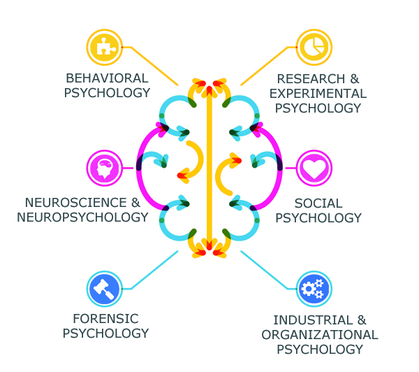

From a young age, I have always been curious about the processes that went into creating video games. I marvel at how realistic 
video games have become in recent years. It’s incredible to see how software engineers are able to build various applications for 
the benefit of specific groups of people, like students. Although my experience in creating software is limited, I hope to learn the 
foundations of software engineering to fulfill my goals. Given my growing passion for psychology, my aim is to develop simple guides, 
possibly in the form of websites or mobile applications, to aid students and children in understanding complex and abstract concepts 
in psychology. 

It would be interesting to see the usefulness of these guides for the various areas of psychology, including social, abnormal, 
cognitive, and much more. After all, there’s more to psychology than Sigmund Freud and psychodynamics. My goal for this aspiration 
is to combine my knowledge in Psychology and Computer Science to give others the opportunity to learn the basics of Psychology 
without having to take intensive courses.    

With this ambition in mind, I hope the accumulated knowledge in software engineering will enable me to program more efficiently. 
Ideally, I would like to think faster and program more efficiently since my brain takes quite a bit of time to process information. 
In addition, I would like to practice collaborating with others on various projects because I created many of my projects 
independently. Furthermore, I would like to gain experience in performing in a high stress environment. By learning to adapt 
in this type of environment, I hope to ease my anxiety when performing under stress. Hopefully, these elements will naturally come 
together so that I can be confident in my skills as a software engineer.   

