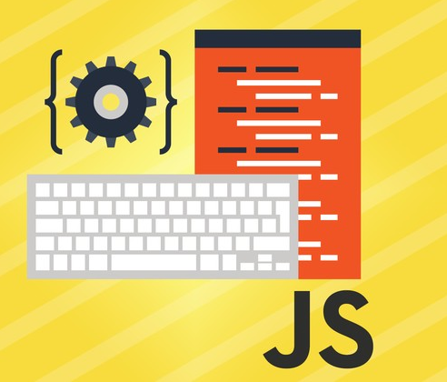

## Why One Should Learn Many Languages

At first, it may seem intimidating and difficult to learn computer languages, let alone many languages at that. After learning multiple languages, it gradually becomes easier to learn another depending on the language. My career as a student in the Computer Science department allowed me to learn and experience *many* languages. For instance, I learned Java in the first year and recently learned Javascript (which is different from Java). I did, however, think it would be very challenging to learn Javascript simply because I was not prepared to learn another unfamiliar language once again. 

### The Power of Learning Javascript

Clearly, there are differences between Javascript and the other programming languages, such as the aforementioned Java and C. Yet, many similarities do exist behind these "back-end" computer languages. For instance, Javascript utilizes the strict equality operator symbol (===) and it essentially compares two data types together. In contrast, Java and C##/C++ do not have this quality in their language. To be honest, I was cautious of using the strict equality operator because it was very foreign to me. Of course, with foreign objects humans/mammals shy away from it since we don't want to be in danger of such objects. After gathering more experience using this operator, I am very aware of how *powerful* and unique this tool is. 

With that being said, Javascript appears to be a decent language for beginner software engineers. It seems to be a simpler version of Java with a mixture of C++ since it shares many commonalities between the two languages. Along these lines, a benefit Javascript offers is the ability to use classes and Object Oriented Programming. OOP is a powerful tool for developers and I believe having it in Javascript would make it easier for people to create software. Using OOP allowed Javascript to be immensely versatile. Its versatile usage allows it to be used in conjunction with many settings, including databases and user interfaces. That makes it incredibly more of an appealing choice to learn and to use when developing web applications.  

## Now Let's Look at Learning from an Athletic Software Engineering Perspective

One may ask how could one *practice* all of the languages they learned, such as Javascript. Well there's a simple solution for that: athletic software engineering. Essentially, athletic software engineering is an approach that allows anyone, primarily students (then again aren't we all students?), to practice their programming skills in a high-stress environment. This allows them to become better software engineers and better programmers overall. Although this is appears to be a surface definition of athletic software engineering, an in-depth explanation to this learning approach, please go to the [Athletic Software Engineering website](http://philipmjohnson.org/essays/ase-2017.html).

Upon hearing about athletic software engineering, I thought it was very novel and unique. It was also difficult to grasp the idea behind athletic software engineering. To practice our skills, we needed to solve various coding exercises, otherwise known as “Work Out of the Day,” in various languages. These languages ranged from our good friend Javascript to testing skills in HTML. These were done to train students to program more efficiently and think faster *while* they were programming.  

### WODs Up with Practicing? 

Practice WODs, or practice “Work Out of the Day,” are coding problems that help students practice for the in-class WODs they would need to take. Surprisingly, these were very beneficial for students in many ways. For myself, practice allowed me to build an idea of what the future WODs would be like. I also gained more experience with using and understanding coding languages I was not used to. After all, practice is the key to learning!

Unfortunately, there is a downside to this type of learning: the high stress level associated with this style of learning. It's incredibly frustrating to be unable to figure out how to get a piece of code to perform the behavior you want in a **short** time limit (e.g. 15 minutes). Nevertheless, I believe this high stress environment was advantageous. If taken seriously, practicing WODs conditioned students to function in a fast-paced environment and to think on their feet. In addition, one gains experience with every WOD they participate in, even if they are unable to solve a particular WOD(s). They end up either learning more by being unable to figure out a WOD or feeling utter joy when they finally figure out the solution! It's almost killing two birds with one stone. Thus, it is a convenient way to help people adapt to the type of environment software engineers are used to in theory.   

## Trying Out the WODs

Although the idea behind the practice WODs is innovative, I would not say they are particularly enjoyable. Despite liking the concept of it, I am still not confident in my skills and ability to perform well in the WODs. It’s a good way to provide mental preparation before programming within a limited amount of time; however, I don’t believe this style of learning is something I would come to enjoy. 

Despite saying this, I have been able to complete some WODs (and was in utter awe when I found a solution), which I can only attribute to luck. As such, my initial indecisiveness of the benefits of participating in WODs was slightly correct to an extent. Obviously, the only way to get better at something is to practice day after day. This is a lesson I was taught time and time again and I will always put it to good use. Experiencing these WODs allowed me to see its benefits of practicing coding and seeing the little intricacies between languages. Unfortunately, I still do not have confidence in my skills as a programmer after performing in these WODs. Aside from my low confidence level, I know I do possess some amount of programming skills I gained from every one of my experiences. Now, the only way up is to **_learn from my experiences_** as a fellow coder.  

