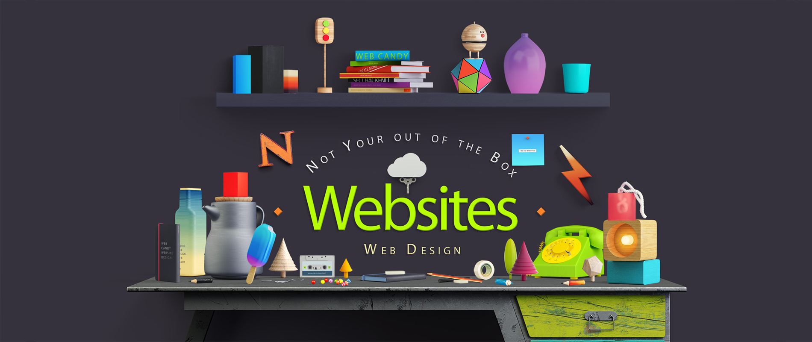
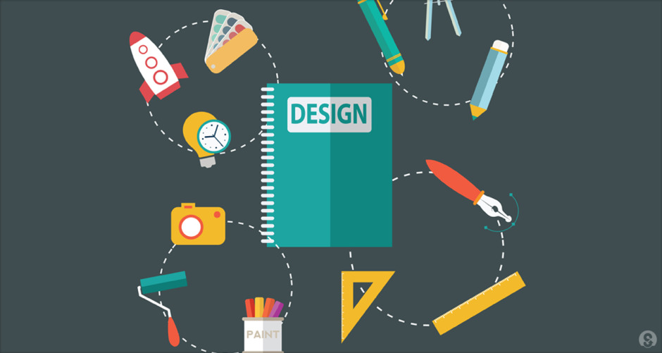

## Wanna Make a Pretty Site?

Ever wondered how people make websites look really really good? I’ve often wondered 
this myself and awed at how beautiful some web pages are compared to others. The 
visually pleasing appearance of most websites is most likely thanks to using a 
specific UI framework. In essence, a framework allows users to create and apply 
beautiful layouts to a web page by using various types of software. This is usually 
done through a combination of [CSS](https://www.w3schools.com/css/css_intro.asp), 
which is a way to style elements in a HTML (which is simply a web page), 
and [Javascript](https://www.w3schools.com/js/), a type of computer language used 
by most web pages. More information about UI frameworks is described briefly in this 
[documentation](https://docs.oracle.com/cd/E12517_01/back_office/pdf/141/html/pos_impg2/uiframework.htm) 
by Oracle which explains how UI frameworks is applied to source code written in Java. 
Among the majority of frameworks out there, one framework in particular stands out for
being challenging, yet easy to implement, and that is Semantic UI.

## Semantic UI at its Worst (or Best!)

Honestly, Semantic UI can be a real pain to learn, let alone understand. It’s like 
learning a foreign language when you’re over 15 years old, let alone over 30. You’ll 
probably feel like you’re in hell trying to spend large amounts of time trying to 
learn another language (unless you’re amazing at learning foreign languages even as 
you get older). Like learning a foreign language, Semantic UI can also be very time 
consuming to learn. Aside from that consequence, it does make websites look good. 
And I mean really good, given the right styling. The [Semantic UI website](https://semantic-ui.com/) 
itself states their framework helps programmers produce beautiful HTML websites when 
they use their layout. I like to think of it as an extension of CSS since it allows 
various elements, such as buttons, to be added to a web page. That definitely makes 
websites look modern and chic. Yet, some elements won’t work without a little 
Javascript magic to make HTML pages more dynamic. 

Not only does Semantic UI make these pages look awesome, it’s also easier to style and 
design these pages. Without Semantic UI, the only options to style a web page and make 
it look pretty is to use CSS and that in itself is very limited. Realistically, they 
don’t offer much when it comes to making a web page look visually appealing to a user. 
In other words, the chances of having someone come back to use a website styled with 
only CSS is really low. I’d say the user wouldn’t even think twice nor look at a 
website designed only in HTML and CSS. A website designed in this manner is really bad, 
like super ugly to look at. In the end, using Semantic UI pays off because it will 
greatly influence the chances of a user using the web page in the long run. More people
will come back to the web page or app and, more importantly, use it if it looks 
aesthetically pleasing.       

  

## Visually Beautiful Objects = Worthwhile

Let’s talk about appearances. Yes, physical appearance. To be frank, the main reason 
Semantic UI and other frameworks are so useful is because they provide a way to create
a visually pleasing appearance to a website/app. But why? Why do we value, what we deem,
a beautiful layout on a website or app to the point where our good friends HTML and CSS 
alone can’t save a webpage under any circumstances? This could come from the idea that
humans are evolutionarily attracted to looks, or the physical appearance, of other humans
since looks are thought to be advantageous to survival. The concept of being attracted 
to visually pleasing humans can be applied to objects in the environmental as well. 
This means we probably find media, such as web pages, apps, or games, attractive 
because we are genetically inclined to find attractive stimuli appealing as aids to our 
survival. The advantage of being beautiful can also be seen from a social perspective. 
Studies have shown that when people are perceived as beautiful, they are more likely to
be more socially competent and happier than people who aren’t beautiful. The same can be
said of beautiful software, meaning an end product that looks visually appealing can 
really get people places. 

## Semantic UI is the Way to Go

Now I’m not trying to say Semantic UI by itself would automatically make a web page look
beautiful. That would be plain stupid. You’ve gotta think with style! (seriously!) 
Rather than changing background or text colors, one can add several elements, such as 
menu bars and icons, to their web pages or apps to improve the appearance of their 
product. Creativity is the key! In fact, the best way to learn how Semantic UI works is 
by going to a few websites and figuring out how they were styled. Of course, most website
s may not use Semantic UI as their framework, however, doing these little exercises is 
probably the best way to learn how to use Semantic UI. It also gets those creative juices
flowing to immensely improve your own web pages and apps. It will definitely take time, 
but it’s so worth it when you create a beautiful product that you can be proud of. 
