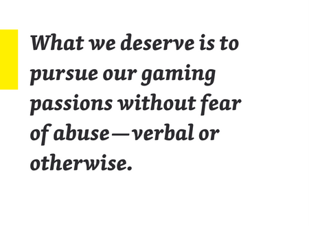

Have you ever made a decision or acted in a way that made your gut sink? If you answered yes, then you are not alone. Often times, people act in ways that go against their morals and have paid the price thereafter. The need to ease that knot in your stomach is a natural response of being human. We are defined by morals so much so that laws and regulations are created to uphold our morals. This is why ethics is so important, especially when it comes to software engineering. It is rare to see coders consider how their source code can affect a stranger’s life in a grand scale. Even though it’s a stretch, the hard truth is not many software engineers would consider how their code, or product, will affect the thousands of people using said product. It takes a big person (not physically!) to think that one moment of err can cost someone their entire life, and I don’t mean just death. Most of the time, we write code to fulfill a client’s expectations while maintaining the client-employer relation. Often times, we don’t think about the potential consequences that could occur, save forgetting/not willing to fix a bug. From an ethical standpoint, we should think not only about others in respect to how our actions affect them, quite literally, but on how our actions reflect our character. 

## What It takes To Understand Harassment

Take for instance the various cases of harassment that happened over the great Internet, such as GamerGate and The Serial Swatter otherwise known as “Obnoxious.” Possibly one of the greatest ethical violation made in both of these harassment situations was the **danger** posed to the inflicted parties. In retrospect, it is possible that the unwillingness of the judicial system to take internet abuse in a serious manner potentially escalated the problems posed in these situations. If precautions were taken to acknowledge the serious effects and ethics internet usage poses, then perhaps more could have been done to aid people who were wronged.  

### Harm through Swatting and Hacking

For instance, the teenage Serial Swatter, or “Obnoxious,” created a major and dangerous situation by harassing hundreds of female Twitch users (Twitch is a way people could broadcast live gameplays and become an active member of that community). Of all the ways to harass them, his ultimatum was enlisting the swat team to swarm these female victims using the guise of drug trafficking and false reports. Obnoxious also committed illegal acts against these victims, including DOXing, which is posing as a user to gain their personal information, and continuously spamming their mobile devices and social media outlets among other methods. The unfortunate aspect of all this was the lack of aid from the judicial system and leniency of the swat team when “apprehending” the victims.   

As a software engineer, Obnoxious obviously violated many ethical guidelines outlined in the [ACM Code of ethics](https://www.acm.org/about-acm/acm-code-of-ethics-and-professional-conduct) as he was acting on his own agenda and did not consider the feelings of his victims nor the potential damage he would inflict. In a way, he undermined what it meant to be a software engineer by most likely writing code to cause harm and immense fear upon another person, violating guideline 1.2 of the ACM Code of Ethics: “Avoid harm to others.” Of course, he violated another guideline, 1.7 “Respect the privacy of others” by gathering his victims’ personal information, hacking into their accounts, and pressuring and blackmailing his victims. In all, his actions have endangered their lives while causing immense anxiety putting this situation in a whole other level of unethical. 

### You Don’t Want to Pass Through the GamerGate 

In a similar manner, the GamerGate incident, often referred to with #gamergate, began with a series of blog posts from the ex-boyfriend, Eron Gjoni, of a well-known female gamer Zoe Quinn. In said blog posts, he outlined his relationship with her and the explicit details her misgivings before and after their breakup. Although this was only one side of the story, his point of view quickly escalated a manhunt for Zoe fueled with death and rape threats towards her and her family. Unfortunately, this case did not resolve peacefully as the aftermath was unrectifiable where Zoe took to the great Internet in attempt to offer her side of the story.

It’s obvious that there is more to the story than Zoe being a conniving and deceitful person and Eron being an unrelenting, creepy abuser. Yet, this did not stop the public from taking to various internet forums and enact an intense, vicious death sentence to a fellow female gamer. It would be ignorant to not say the entirety of this situation violated many ethics, let alone ethical standards. After reading said blog posts from both Eron and Zoe, it is clear that a huge amount of “evidence” was used against both parties, primarily Zoe. However, upon making said evidence viewable to the public, both parties essentially violated each other’s privacy (as I’m sure they didn’t ask for permission to post screenshots of private conversations to be used against each other). Not only that, but making this whole situation *public* calls for a need to evaluate what types of information should be made publicly viewable. Of course, free speech is a human right everyone is entitled to, but the question will always be when this right can go too far as in this situation. 

Now, how exactly does this relate to the ethics in software engineering would you ask? To be frank, Zoe and Eron are software engineers and have worked together on projects before, meaning they should have held an ethical standing and professional relationship (despite being romantically involved). Aside from the privacy issue, it seems both parties did not necessarily respect each other in a professional sense. In other words, it appears they did not adhere to a number of the eight principles in the [Software Engineering Code of Ethics and Professional Practice](https://www.computer.org/web/education/code-of-ethics). These principles outline what a software engineering should ethically uphold for themselves and others. In particular, they did not respect these principles, judgment, profession, and colleagues, probably out of resentment or intense anger. Instead of being professional towards each other, they judged each other based on personal feelings, not in regards to their professional experience and merit. After all, we all want to pursue the ideal of this quote below:    

  

## How We Fit In These Ethical Issues

Thinking about ethical issues and how we fit into this ethical equation is not an easy feat. I believe many do not integrate ethical standards into the great, all-encompassing application they’re building simply because that isn’t what they are after. From my point of view, it takes an incredible amount of knowledge from a humanistic side that many, surprisingly, do not have/have yet to learn. Not to say most people think in this way, but I believe it is incredibly difficult to place oneself outside of themselves and their work and contemplate how their creations will affect (not just benefit) the so called “greater good.” Heavy stuff I know. After all, the real world isn’t just about creating source code at a user’s request (and in a small part to make profit); it’s about understanding how we as software engineers have the potential to affect the inhabitants of the whole world as we develop relationships with these comrades. Even considering how ethical the actual **_development_** of applications are is essential in preventing future disasters! No one wants to be the reason why someone is dead from an error that could have been easily fixed or from not understanding what was morally wrong in the development process.

