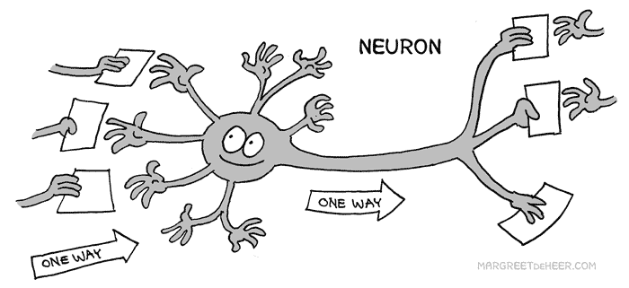

## What happens in a crash 

“Look out! Ship Meteor crash landing from space in 5, 4, 3, 2… ” So, what happens next? Does the fictitious ship named Meteor crash onto Earth or does it disappear to a place outside Earth’s atmosphere? The most probable outcome to this dilemma is... it crashes to Earth, much like how an application crashes in Meteor (yes, Meteor isn’t just a name of a fictitious ship). Meteor is a program which combines the functions of JavaScript, MongoDB (a database), NodeJS (essentially Javascript that helps in networking), and Semantic UI to create a dynamic application as explained in the Meteor [guide](https://guide.meteor.com/). The feeling you get when your application crashes, or doesn’t function in the way you want, in Meteor is like watching an actual ship crash to Earth because of some sort of malfunction. To put it simply, the feeling is of *utter devastation and dread* because you know that (1) your soul died a little and (2) cleaning up the remnants of this so called crash is tough, I mean really tough. I can guarantee an app crashing or not working in Meteor is something everyone has experienced and relate to. It’s so common that the worse part in an app crash is 100% trying to figure out **_how_** to fix the problem. 

## The Pain that Flies with Meteor

I’m not going to lie, Meteor is complicated. It’s also a very powerful tool, hence why it’s so complicated. There are *many* difficulties with using Meteor, one being the extensive amount of time it takes to create applications within its little framework. Now, what exactly do I mean by that? Let’s take for instance the time it takes to build an app for the very first time (essentially creating a basis of it). 

Unfortunately, Meteor could take, in the worst case, one hour to use all of its resources to make the app and in the very best less than two minutes, if one is lucky. In my case, the most time an application would take was for about 10 minutes. Usually, this isn’t a huge problem, however, this uses **_a ton_** of battery. I’m not even kidding. From my experience, the battery from my (fairly new) laptop has drained about 20% from building my application alone; it’s pretty scary. Not to mention, the time it takes to “index” your environment on the IDE you’re running will initially take **_forever_**! Basically, Meteor is trying to make sure all the files in your directory and those that appear in your IDE are synchronized and running correctly on your host machine so that your app runs smoothly. 

Aside from the long build time, it’s also a tad bit difficult to learn how Meteor works. What I mean is by understanding the fundamentals of how data is sent and received from the client and server sides. Meteor’s guide has a pretty simple, yet effective, way of summing up the relationship between the client and server. Essentially, the client receives, or in Meteor’s term “renders,” the data sent by the server and does some type of behavior with that data. Although this may seem far fetched, it’s almost like how a communication happens in the brain. Your brain has messenger hubs called neurotransmitters. These neurotransmitters carry chemical signals in order to communicate with each other by sending and receiving signals from other neurotransmitters within the synapse, or the space between each neurotransmitter (yes, neurons don’t touch each other). That is, one neurotransmitter sends a signal, like a server sends its signal, and another neurotransmitter receives and interprets that signal just as a client would. Without the constant communication of these signals, you probably wouldn’t be alive and functioning normally! 

## Fun with Meteor 

Despite needing to learn the relationship between the client and server and long build time, Meteor makes it easier to assemble all the parts of an app together. Since Meteor essentially breaks all of the needed elements into parts, sub-elements can be added within every aspect of an application. For instance, if you wanted to add contacts to a contact list, you could create a directory within the client or server side and creating more elements pertaining to adding contacts. I find that having everything separated into its own part makes it easier for **organizing** which elements go where and sort of forces the creator to **figure out** what elements should be **seen** by the client or the server. Even though Meteor is the first client-server “application architecture” I’ve encountered, it has helped me understand the client-server relationship a little more and how that relationship relates to application development. Although, remembering to include all the necessary files in the right places can be annoying at times, especially the root cause of an application crash/incorrect behavior results from not including files.

Since using Meteor, it’s amazing how how applications can be made using this, essentially, small system. There doesn’t seem to be much going on on the surface; however, so much is happening within Meteor that aids in building apps. This is pretty impressive considering Meteor, a fairly complex program, does all the work for the programmer while the user just has to “code” in theory. I have to admit, this is a cool feature of Meteor and I still get a basic understanding of how applications are built. Using Meteor is like a way of putting everything into perspective to make something useful and awesome.
