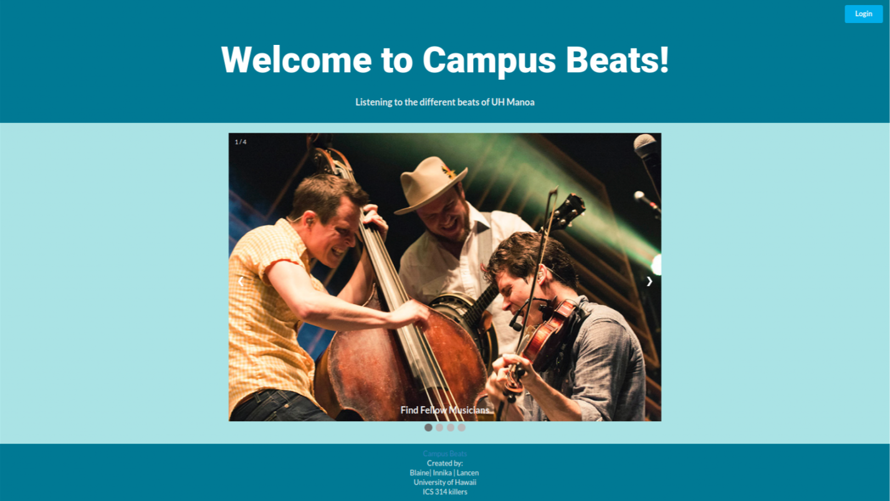
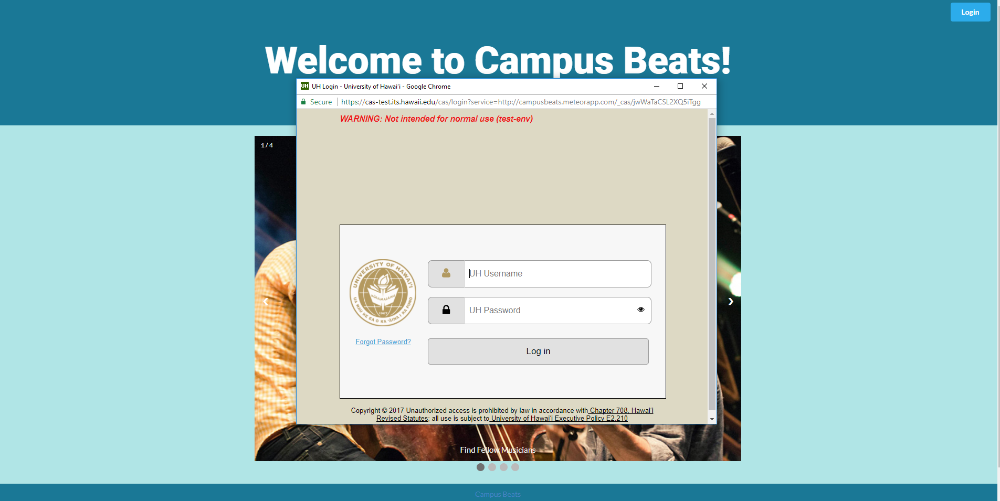
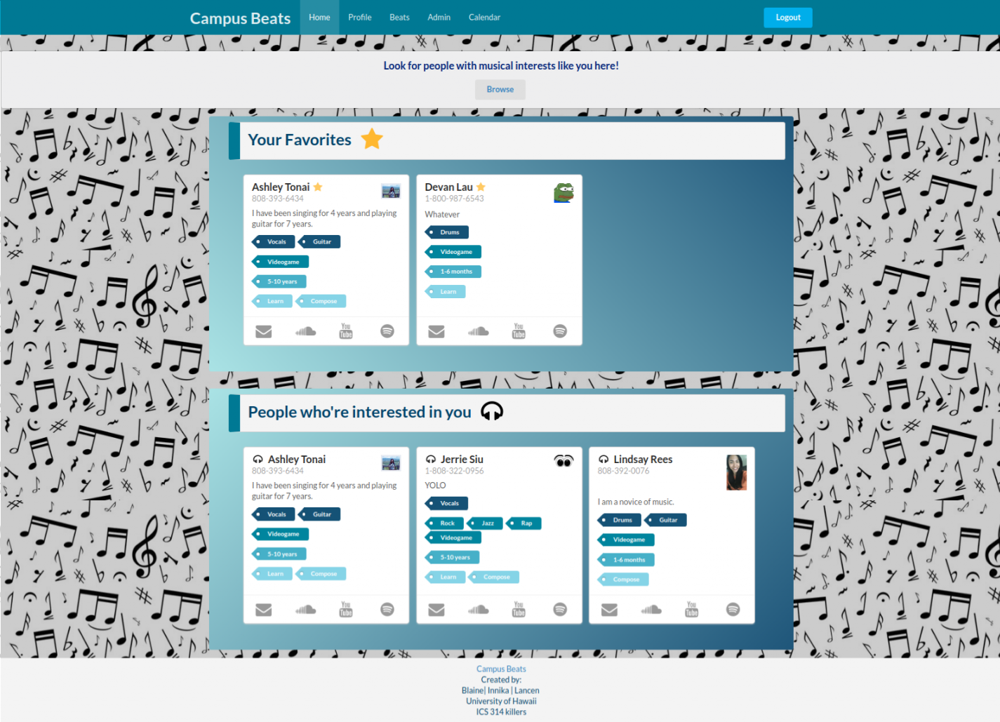
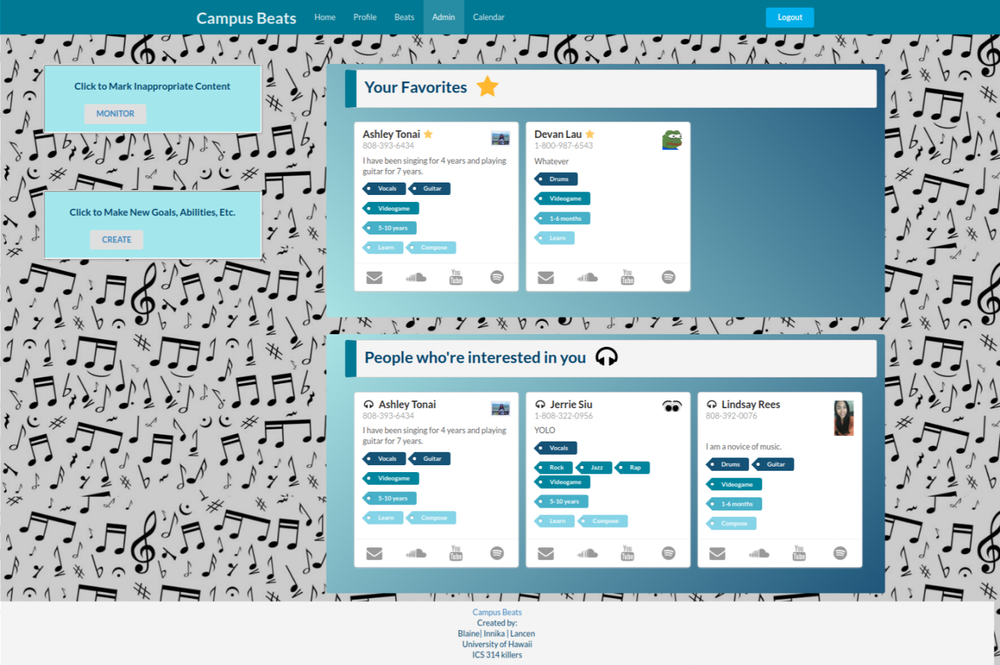
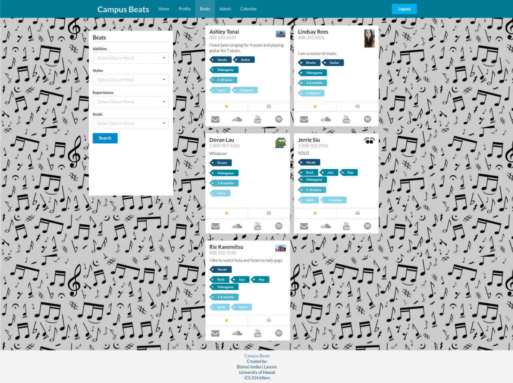
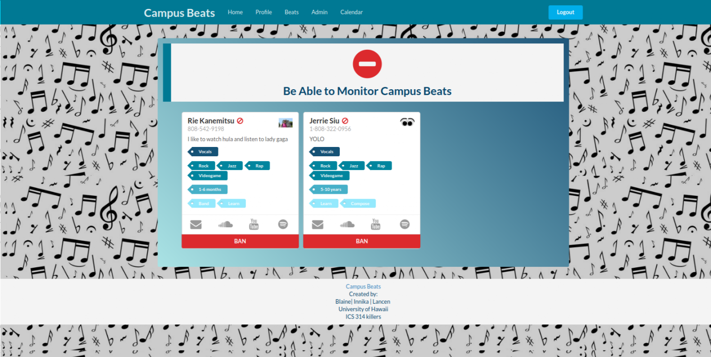
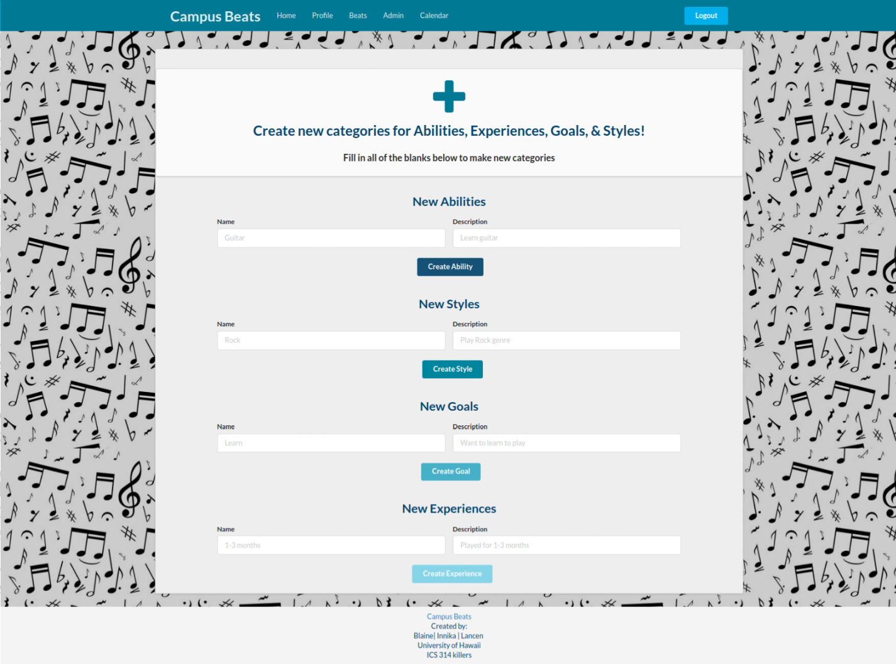

## Campus Beats: What Is it?   

Campus Beats is an application that is intended for musically inclined users, mainly students, to find and jam out with each other (i.e. meet up and play music together or have someone make music for software, like a video game). It was built by Blaine Wataru, Lancen Daclison, and I who are students of a Computer Science course, Software Engineering, as our final project. To see the source code for this project, one may go the <i class="small github icon"></i>[Campus Beats repository](https://github.com/campusbeats/campusbeats) and clone/download the zip file to use the application. This application does have a user login where only those with a University of Hawaii account may access the page via the CAS login. 

(--screenshot of pages & CAS login here--)

This is the landing page of the application, what the user would see upon first viewing the app:

 
  

Below demonstrates the CAS login allowing users to access the app:

 
  

## The Tools Used to Create the Application

Throughout the development process, many tools were used to create the application. Meteor was used to build and run our application. The source code needed to reflect Meteor’s language with the inclusion of HTML/CSS and Javascript. Together with Meteor, MongoDB was also used to create “Collections,” which were essentially containers of data that consisted of our database together. Again, the source code for the collections also needed to meet the standards for Meteor's guidelines. For designing, HTML, CSS, & Semantic UI were heavily used. Both Semantic UI and CSS can be found throughout the source code for the web pages while the backbone of the HTML coding needed to be change to adhere to the Templates provided in Meteor. The main back-end language used was Javascript. It helped to make our web pages dynamic and functional, yet it required an understanding of the connection between MongoDB and Meteor. Our source code also needed to follow the ECMA6, the most recent version, of Javscript. The IDE used for this project was IntelliJ Idea. It was chosen for its mass number of functions applicable to this multi-language application. In order to identify errors and potential compiler errors and adhere to the coding standard, ESLint was used. Errors were designated by either red/yellow if the source code was not up to standard (i.e. fails the coding standard set by the class and ECMA6) or a green check mark if it passed. The command line was also used to run the application and detect errors with ESLint if necessary. Lastly, **the mind** was the last tool as my mind alone had to think about designs and how to make the web page functional while writing the source code 

## My Contributions To the Application

For this application, I had a great contribution in terms of design and hard coding aspect. First, I designed the whole user interface (i.e. almost all of the web pages used in this application) with HTML, CSS, and Semantic UI. I used a color palette to decide which colors would go well with the background I chose (to which I dimmed the background color, so it was a light gray, to create a prominent contrast between objects and the background). The specific pages I designed were the (User) Home page, Admin Home page, Beats page (compromising another member’s design with our initial design), and pages for admin controls (Monitor page and Create page). The Profile page and the Landing page initial design were done by the other members of my team, however, I went back and changed the color schemes of these pages after receiving suggestions. 

Below are the pages I designed and also the pages I needed to tweak to create a better design:

This is the Home page:

 
  

The Admin Home page:

 
  

The Beats page:

 
  

The Admin Monitor page:

 
  

And the admin create page:

 
  

Second, I aided in creating half of the search algorithm our application would utilize to search for user profiles in the Beats page. For this specific page, we hoped to have dropdown menus that would allow users to click on as many of listed choices they desired and be able to search for profiles based on their criteria. In attempting to emulate this idea, I attempted to figure out how to alter a given base algorithm to create the desired behavior for one category. After I figured that out, I asked another member to help with figuring out how to do it for all of our categories, which he was able to do. the rest of the algorithm since it was a  base search algorithm to function to our needs. 

Third, I created the functionality of the admin controls which would allow admins to ban inappropriate users and create new categories/options for users to utilize in making/updating their profiles and searching. I was initially able to figure out how to add categories by going through the same process as before and making my way through all of the categories. I did hit a snag at first and needed to revise the working source code I had. Then, I proceeded to “ban” users by removing their profile from the system. Since my team agreed to create another set of profiles and remove users from there, I banned the users in the set of profiles. Unfortunately, I could not get the function to behave correctly such that the user is only able to choose the first profile in the set to remove. 

Lastly, I contributed immensely to the documentation explaining the usage of our application and the development process. Throughout the given time span, I would make small edits every now and then to our documentation. Eventually, I documented the entire development process for the second half of our project, which was creating a better design and added functionality to many components of the project, and notated what I thought another user would find important in terms of usability.

## This Learning Process Was Tough

To my surprise, I learned an immense amount of information and about teamwork. I was very surprised to know that all of the information and skills I learned over the course somehow made it into my brain. While working, I was able to remember some of the skills I used for Meteor as well as putting my novice design skills to use. Surprisingly, I was learning while writing source code and theorizing what should work and what may not work in terms of the back-end aspects. Honestly, I found this to be incredibly frustrating because back-end is not exactly my strong point. However, playing with the source code and figuring out what worked and what didn’t helped me to learn that every part of the application is either individualized or need to work together to function effectively. It allowed me to see that different parts of the application can perform *very different* behaviors. For instance, while developing both the search algorithm and the algorithm to add categories, I realized they were very similar in terms of code; yet, the code for both needed to be tweaked to guarantee a specific behaviors.   

I was particularly impressed with the designs I came up with. Even if designing took time, I really enjoyed doing it. The design process for this application allowed me to appreciate being a Psychology major, having to know what a user may or may not want to see, and combining that with creating a user friendly design. I had a lot of fun playing with the color schemes and figuring out where elements should go, despite how tedious it all ways. Thanks to this project, I can actually see myself wanting to have a career in web design simply because it’s something I would enjoy doing in the long run while putting other skills to use. 
