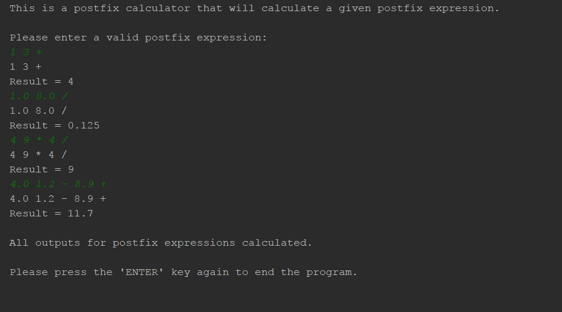

## Campus Beats: What Is it?   

Campus Beats is an application that is intended for musically inclined users, mainly students, to find and jam out with each other (i.e. meet up and play music together or have someone make music for software, like a video game). It was built by Blaine Wataru, Lancen Daclison, and I as a project for a Computer Science course, Software Engineering. To see the source code for this project, one may go the <i class="small github icon"></i>[Campus Beats repository](https://github.com/campusbeats/campusbeats) and clone/download the zip file to use the application. This application does have a user login where only those with a University of Hawaii account may access the page via the CAS login. 

(--screenshot of pages & CAS login here--)

## The Tools Used to Create the Application

## My Contributions To the Application

For this application, I had a great contribution in terms of design and hard coding aspect. Below are my listed contributions to this application: 
  * I designed the whole user interface (i.e. all of the web pages used in this application) with HTML, CSS, and Semantic UI. I used a color palette to decide which colors would go well with the background I chose (to which I dimmed the background color, so it was a light gray, to create a prominent contrast between objects and the background). The specific pages I designed were the (User) Home page, Admin Home page, Beats page (compromising another member’s design with our initial design), and pages for admin controls (Monitor page and Create page). 
  * Aided in creating half of the search algorithm our application would utilize to search for user profiles in the Beats page. For this specific page, we hoped to have dropdown menus that would allow users to click on as many of listed choices they desired and be able to search for profiles based on their criteria. In attempting to emulate this idea, I attempted to figure out how to alter a given base algorithm to create the desired behavior for one category. After I figured that out, I asked another member to help with figuring out how to do it for all of our categories, which he was able to do. the rest of the algorithm since it was a  base search algorithm to function to our needs. 
  * Created the functionality of the admin controls which would allow admins to ban inappropriate users and create new categories/options for users to utilize in making/updating their profiles and searching. First, I was able to figure out how to add categories by going through the same process as before and making my way through all of the categories. I did hit a snag at first and needed to revise the working source code I had. Then, I proceeded to “ban” users by removing their profile from the system. Since my team agreed to create another set of profiles and remove users from there, I banned the users in the set of profiles. Unfortunately, I could not get the function to behave correctly such that the user is only able to choose the first profile in the set to remove. 
  * Contributed immensely to the documentation explaining the usage of our application and the development process. Throughout the given time span, I would make small edits every now and then to our documentation. Eventually, I documented the entire development process for the second half of our project, which was creating a better design and added functionalities, and notated what I thought another user would find important in terms of usability.

## This Learning Process Was Tough

  

