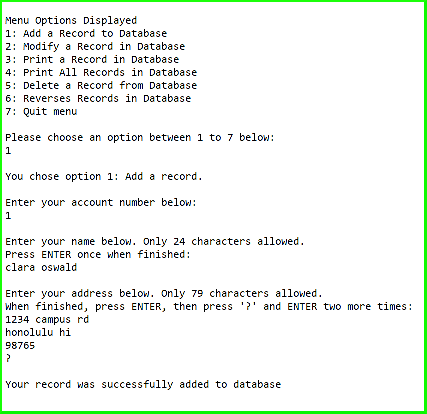

The bank database was a final project in ICS 212 (Program Structures), Summer 2017. One aspect of this project was to implement a linked list of the records in the database. The information in these records contained the user's account number, name, and address. The other aspect was to create a menu of seven options which would somehow affect the linked list, such as adding to, deleting from, or reversing the record(s) in the database. Ideally, the user would be able to choose an option from the menu and that option would correspond to an action performed on the linked list (the database). 

The Teaching Assistant for this course, Tetsuya Idota, provided the structure in the record.h file and the class prototypes in the llist.h file. Aside from the files the TA gave, I implemented the other source code, including the class definitions in the llist.cpp file.  

This was a very large scaled project that required many components, such as the user-interface (the menu), and was particularly intimidating. It seemed intimidating initially because of the number of components need to function and the fact that one wrong piece/line of source code could essentially ruin the whole project. Yet, it did not seem as terrifying as I thought it would be. Programming this project taught me the value of time management and being able to fully understand what is going on in the source code (or to see the code the way the CPU sees it). The course itself has also taught me many lessons that I will, hopefully, not forget, such as understanding the meaning of a set of instructions and asking the right questions when instructions are vague. 

Below is a sample of the text-based output when the user wants to add a record to the database and the source code. 

   

 
Source: <a href="https://github.com/innikakp/Bank-Database"><i class="large github icon"></i>innikakp/Bank-Database</a>
